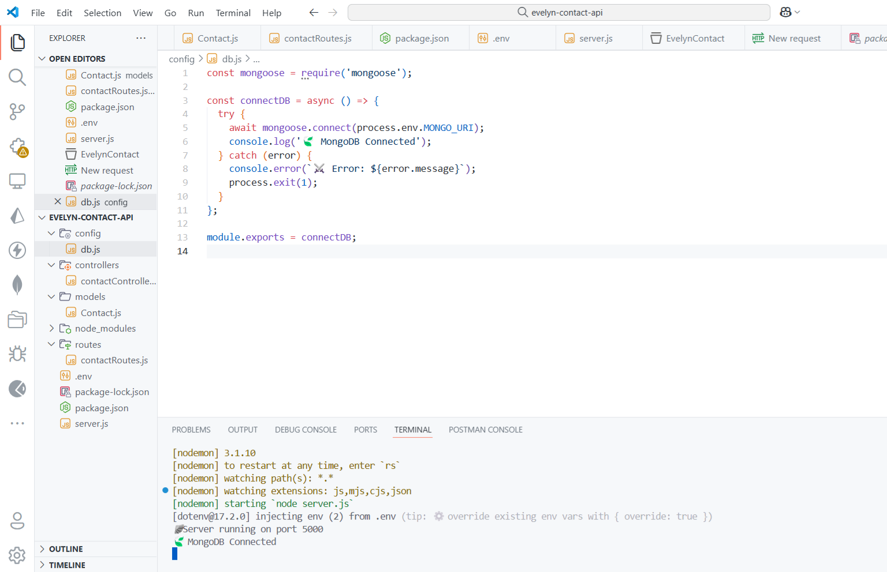
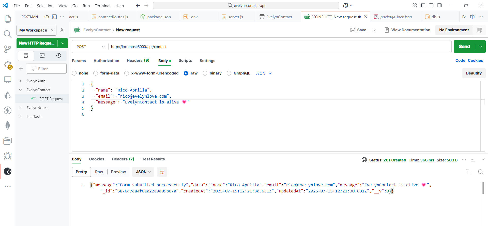

A minimalist POST-only contact form backend built with **Node.js**, **Express.js**, and **MongoDB** — made to *listen*.

Because even an API should be capable of hearing you out. 🪽

---

## Features

- POST-only endpoint: /api/contact
- Accepts JSON payload:
  
json
  {
    "name": "Your Name",
    "email": "your@email.com",
    "message": "Your message"
  }

- Saves messages to MongoDB
- Input validation
- Clean, modular structure (MVC)
- Powered by intention 🖤

---

## Tech Stack

● Node.js
● Express.js
● MongoDB (via Mongoose)
● dotenv
● Postman (for testing)

## Preview Architecture

🍃 > Getting Started

1. Clone the repo

bash
git clone https://github.com/ricoaprillananda/EvelynContact-API.git
cd EvelynContact-API

2. Install dependencies

bash
npm install

3. Add .env file
   
PORT=5000
MONGO_URI=your-mongodb-uri-here

4. Run the server
   
bash
npm run dev

---

## API Testing (via Postman)

Method: POST

URL: http://localhost:5000/api/contact

Headers (pgsql):
Content-Type: application/json

Body (json):
{
  "name": "Rico",
  "email": "rico@evelynlove.com",
  "message": "EvelynContact is alive 💗"
}

## Philosophy
A form is not just an input.
It’s a message.
A whisper into the void, hoping someone listens.
EvelynContact was built to listen.
